# cookiecutter-fastapi

In order to create a template to FastAPI projects. :rocket:

## Cookiecutter

Cookiecutter is a CLI tool (Command Line Interface) to create an application boilerplate from a template. It uses a templating system — Jinja2 — to replace or customize folder and file names, as well as file content.

### How can I install?

```bash
pip install cookiecutter
```

### How can I generate a FastAPI project?

```bash
cookiecutter gh:arthurhenrique/cookiecutter-fastapi
```

### Hands On



## Development Requirements

- Python3.8.2
- Pip
- Poetry (Python Package Manager)

## Installation

`make install`

## Runnning Localhost

`make run`

## Deploy app

`make deploy`

## Running Tests

`make test`

## Runnning Easter Egg

`make easter`

## Access Swagger Documentation

> <http://localhost:8080/docs>

## Access Redocs Documentation

> <http://localhost:8080/redoc>

## Project structure

Files related to application are in the `app` or `tests` directories.
Application parts are:

    app
    ├── api              - web related stuff.
    │   └── routes       - web routes.
    ├── core             - application configuration, startup events, logging.
    ├── models           - pydantic models for this application.
    ├── services         - logic that is not just crud related.
    └── main.py          - FastAPI application creation and configuration.
    ├──
    tests                - pytest
